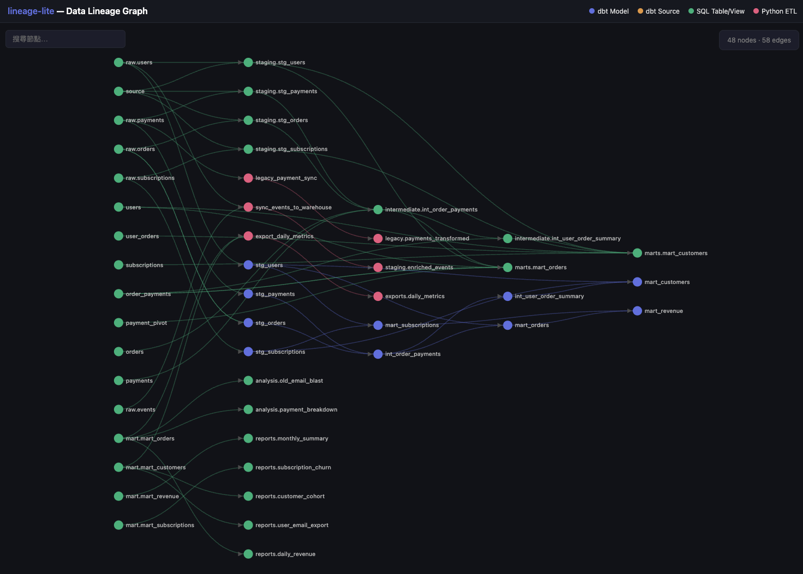
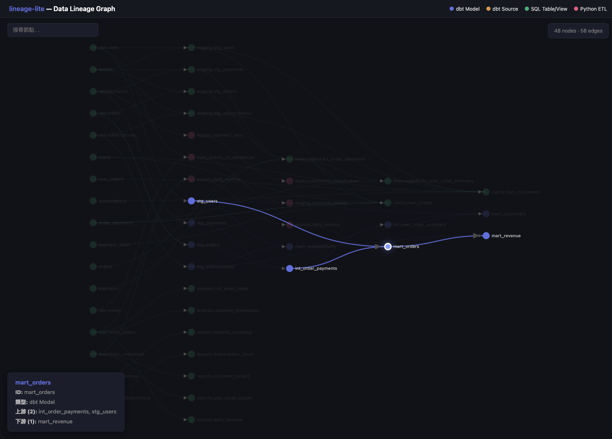
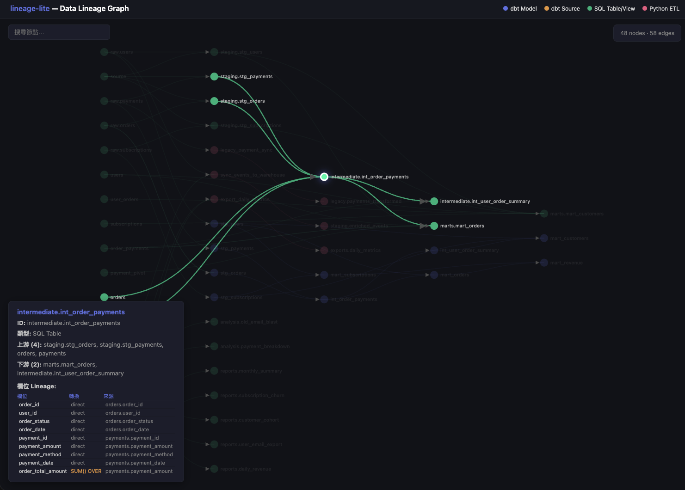
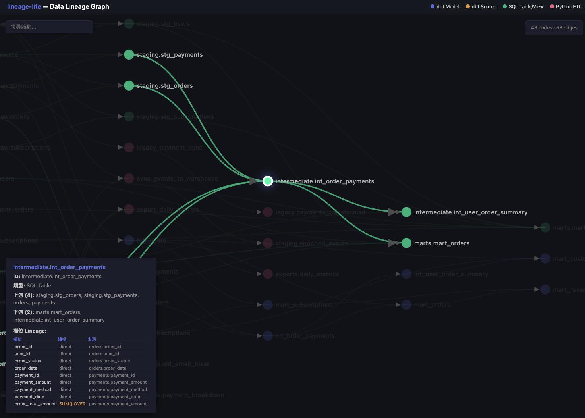

# lineage-lite

靜態 lineage 分析引擎，用於資料治理。

lineage-lite 從 SQL、dbt model、Python ETL 等原始碼中，靜態分析出真正的 source → transform → sink 資料流關係，建立完整的 DAG（有向無環圖），讓 impact analysis、onboarding、治理 policy 驗證都有可靠的依據。

## 解決了什麼痛點？

資料工程社群長年有這些未被好好解決的問題：

| 痛點 | 現狀 | lineage-lite 的解法 |
|------|------|---------------------|
| **dbt lineage 只看得到 dbt model** — 旁邊的 Python ETL、手寫 SQL 報表完全不在圖上 | dbt lineage graph 到 source 就停了 | `scan` 同時掃 `.sql` + `.py`，所有類型的資料流一張圖串起來 |
| **改 schema 前不知道影響範圍** — 只能靠「印象」和 grep，結果報表壞一週 | 「應該不會壞很多」| `impact raw.payments` → 列出所有下游，包含沒人知道的 legacy job |
| **Column-level lineage 缺失** — 知道 A 表到 B 表，但不知道 `lifetime_value` 從哪裡 SUM 出來 | dbt-core [Discussion #4458](https://github.com/dbt-labs/dbt-core/discussions/4458) 喊了好幾年 | `trace marts.mart_customers` → 每個欄位的來源、轉換類型、SQL 表達式 |
| **PII 散落不知道** — email、phone 出現在不該出現的 schema，治理會議上沒人答得出來 | 手動盤點 | `stats --where column=email` → 立即找出所有含 PII 的表 |
| **Data contract 無法自動驗證** — policy 寫在 wiki 上但沒人遵守 | 靠人工 review | `check --rules .lineage-rules.toml` → 自動檢查違規 |
| **新人 onboarding 看不懂 pipeline** — Wiki 過時，架構圖跟實際 code drift | 兩週才搞懂資料流 | `show mart.orders --upstream 4` → 直接看到真實的上下游鏈路 |
| **Jinja macro 讓 dbt 程式碼無法閱讀** — 500 行 Jinja、47 個壞掉的 model、1 個離職的工程師 | 沒有好的工具能從 Jinja SQL 中提取結構 | 讀取 `dbt compile` 產出的 `target/compiled/` 做 column-level 分析 |

## 運行畫面

`lineage-lite scan ./demo --format html --out lineage.html` 會產出一份零依賴的互動式 HTML，在瀏覽器裡就能瀏覽整張 lineage graph。

### 整體 lineage graph



一張圖同時看到 dbt model、SQL 表 / View、Python ETL 彼此之間的 source → transform → sink 關係。右上角 legend 以顏色區分節點類型，右上角顯示總節點數與邊數。

### 點選節點 → 看它由「哪幾張表」組成



點一下 `mart_orders`，上游鏈路立刻被 highlight，左下角面板列出節點類型、檔案路徑、所有上游與下游表。改 schema 前不用再靠 grep 猜爆炸半徑。

### 點選節點 → 看它由「哪些欄位」計算而來



選到 `intermediate.int_order_payments` 時，面板會展開 **Column Lineage** 區塊，列出每個輸出欄位的來源欄位與轉換類型（direct / SUM / expression / window）—— 這是 dbt-core 喊了好幾年還沒內建的 column-level lineage。



把 graph 縮到剛好框住節點的上下游，同一個面板同時看得到「由哪幾張表組成」和「每個欄位從哪裡來」。

## 安裝

```bash
cargo install --path .
```

## 快速開始

```bash
# 掃描整個 repo，建立 lineage graph
lineage-lite scan .

# 改 schema 前先看影響範圍
lineage-lite impact raw.payments --path .

# 產生互動式 HTML 視覺化
lineage-lite scan . --format html --out lineage.html
```

## 文件導覽

- `README.md`：快速上手、指令與整體功能
- `BEGINNER_GUIDE.md`：給 Rust 初學者的專案入門，先用例子理解原理
- `docs/reading-guide.md`：Rust 實作者閱讀指南索引，給不同程度的讀者不同切入點
- `docs/01-overview.md`：專案導覽篇，帶你看中型 Rust 專案怎麼拆模組、trait 在真實情境下長什麼樣
- `docs/02-rust-notes.md`：Rust 複習篇，對照本專案實際用到的 `mod`、`crate::`、`super::`、trait、borrow 寫法
- `docs/03-code-flow.md`：流程與練習篇，跟著 `scan` 追進 code，附八題練習與參考答案
- `WALKTHROUGH.md`：程式碼閱讀順序與模組導覽
- `TECHNICAL.md`：深入設計、Rust 手法與演算法拆解

## 所有指令

### `scan` — 掃描並建立 lineage graph

```bash
lineage-lite scan ./your-repo

# 輸出格式
lineage-lite scan . --format table    # 終端機表格（預設）
lineage-lite scan . --format dot      # Graphviz DOT
lineage-lite scan . --format html --out lineage.html  # 互動式 HTML

# 匯出到 SQLite
lineage-lite scan . --out lineage.db
```

### `impact` — Schema 變更的影響分析

```bash
lineage-lite impact raw.payments --path ./your-repo
```

列出某張表的所有下游節點（dbt model、SQL 報表、Python job），讓你在 PR 前就知道改動的爆炸半徑。

### `show` — 顯示上下游鄰域

```bash
lineage-lite show mart.orders --upstream 4 --downstream 2 --path .
```

### `trace` — Column-level lineage 追蹤

```bash
# 追蹤純 SQL 表的欄位來源
lineage-lite trace reports.daily_revenue --path .

# 追蹤 dbt model（需要 dbt compile 後的 target/compiled/ 目錄）
lineage-lite trace marts.mart_customers --path .
lineage-lite trace marts.mart_customers --path . --compiled target/compiled/
```

輸出每個欄位的來源欄位、轉換類型（direct / SUM / COUNT / expression）、和原始 SQL 表達式。

### `stats` — 統計與欄位搜尋

```bash
# 總覽
lineage-lite stats .

# 找出所有包含 email 欄位的表
lineage-lite stats . --where column=email
```

### `check` — Data contract 驗證

```bash
lineage-lite check . --rules .lineage-rules.toml
```

規則檔案範例（`.lineage-rules.toml`）：

```toml
[[rules]]
name = "pii-isolation"
type = "column-deny"
columns = ["email", "phone", "id_number"]
denied_schemas = ["reports", "analysis", "exports"]
message = "PII 欄位不應出現在此 schema"
```

### `diff` — 比較兩次 scan 的差異（CI 整合）

```bash
# 先儲存基準
lineage-lite scan . --out baseline.db

# 改完 code 後比較差異
lineage-lite diff baseline.db .
```

輸出新增/移除的 nodes 和 edges，適合放在 PR review 或 CI pipeline 中。

### `merge` — 合併多個 repo 的 lineage

```bash
lineage-lite merge repo-a.db repo-b.db --out merged.db
```

## 支援的來源類型

| 類型 | 偵測方式 | 提取的關係 |
|------|----------|------------|
| **SQL** | `.sql` 檔案（不含 Jinja） | `FROM`、`JOIN`、`INSERT INTO`、`CREATE TABLE AS`、`CREATE VIEW`、CTE |
| **dbt** | `.sql` 中包含 `{{ ref() }}` / `{{ source() }}` | model 之間的依賴 |
| **dbt compiled** | `target/compiled/` 目錄 | column-level lineage（Jinja 展開後的純 SQL） |
| **Python ETL** | `.py` 檔案 | `read_sql`、`to_sql`、`saveAsTable`、`insertInto`、`spark.table()` |

## 架構

```
src/
├── cli.rs               # CLI 入口（clap derive）— scan/impact/show/trace/stats/check/diff/merge
├── error.rs             # 統一錯誤型別（thiserror）
├── graph/
│   ├── mod.rs           # LineageGraph（petgraph wrapper + BFS）
│   ├── node.rs          # Node、NodeKind、LineageEdge、EdgeRelation、ColumnLineage
│   └── query.rs         # stats 查詢
├── scanner/
│   ├── mod.rs           # Scanner trait + ScanOrchestrator
│   ├── sql.rs           # SQL 掃描器（sqlparser-rs AST + column-level lineage）
│   ├── dbt.rs           # dbt 掃描器（regex）
│   └── python.rs        # Python ETL 掃描器（regex）
├── storage/
│   ├── mod.rs           # StorageBackend trait
│   └── sqlite.rs        # SQLite 持久化
└── output/
    ├── mod.rs           # Renderer trait
    ├── table.rs         # 終端機表格
    ├── dot.rs           # Graphviz DOT
    └── html.rs          # 互動式 HTML（vanilla JS + SVG，零依賴）
```

### 設計亮點

- **Scanner trait** — 新增檔案類型只需實作一個 trait，ScanOrchestrator 按副檔名自動 dispatch
- **Column-level lineage** — 從 SQL AST 提取每個欄位的來源和轉換類型（direct / aggregation / expression / window）
- **CTE 穿透** — `SELECT * FROM final_cte` 會自動往內追蹤到 CTE 定義的實際欄位
- **Domain enums** — `NodeKind` / `EdgeRelation` / `TransformKind` 用 Rust 型別系統編碼領域知識
- **thiserror 錯誤處理** — 結構化錯誤，library code 無 `.unwrap()`
- **lib.rs re-exports** — 既是 CLI 工具，也能作為 library 被其他 Rust 專案引用

## Demo

`demo/` 目錄包含一個完整的 XYZMart 情境，模擬真實的電商資料團隊：

- dbt 專案（staging → intermediate → marts，含 Jinja macro、`{{ config() }}`、``）
- SQL 報表（BI 團隊手寫的 CREATE VIEW / CREATE TABLE AS）
- Python ETL（舊版的 pandas read_sql → to_sql）
- dbt compiled SQL（`target/compiled/`，Jinja 展開後的純 SQL）
- Data contract 規則（`.lineage-rules.toml`）

```bash
# 試跑
lineage-lite scan ./demo
lineage-lite impact raw.payments --path ./demo
lineage-lite trace marts.mart_customers --path ./demo
lineage-lite check ./demo --rules ./demo/.lineage-rules.toml
lineage-lite scan ./demo --format html --out lineage.html
```

## 開發

```bash
cargo build     # 建置
cargo test      # 47 個測試
cargo clippy    # lint
```

## License

Apache License 2.0 — 詳見 [LICENSE](LICENSE)
